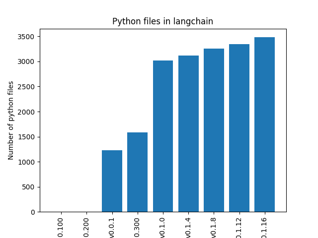
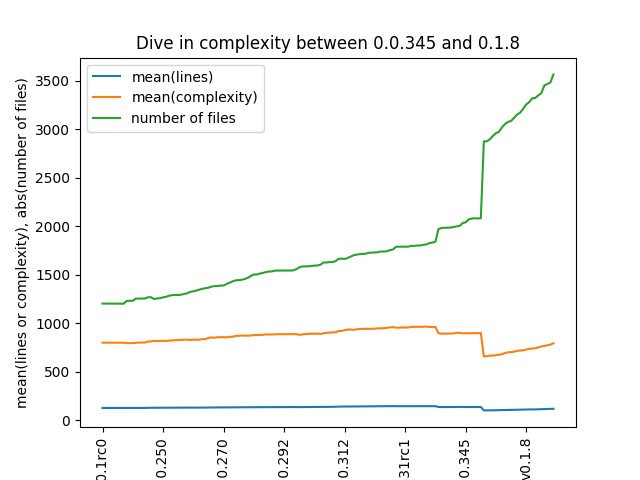

# Architectural Reconstruction report

Course: Software Architecture 2023/2024

Supervised by: Mircea Lungu, Kontantinos Manikas, and Riasat Abbas

Author: Andreas Kaas Johansen

Date: May 19th, 2024

# Introduction

**Disclaimer** This report is still a work in progress.

In the Architectural reconstruction assingment I wanted to take a look at the python langchain package.

A package which is very used in the LLM community to chain prompts together and interact with vector databases to get more powerful and robust prompts using LLMs.

The first commit of the repository was created on Oct 24 2022 so at the time of writing it is barely 2 years old. In this time it has gained a lot of popularity with 83500 stars on github and 12800 forks. The repo has over 484 contributors and is changing rapidly. I'm curious to see how this repository has developed over time, code quality- and structure wise. And to see if there if a code analysis will yield any structural "issues" in the repository that could be addressed

**Hypothesis one**: The rapid development of the package and the LLM space in general has lead to "spaghetti code" - increasing code complexity over time

**Hypothesis two**: The rapid development has introduced many new abstractions or modules over time-

\newpage

# Initial analysis

At first I decided on some releases I wanted to include in my analysis in order to not get swamped with too much data. I decided on the following release tags:

| Tag      | datetime   |
|----------|------------|
| v0.0.100 | 2023-03-02 |
| v0.0.200 | 2023-06-13 |
| v0.0.1   | 2023-07-22 |
| v0.0.300 | 2023-09-22 |
| v0.1.0   | 2024-01-05 |
| v0.1.4   | 2024-01-25 |
| v0.1.8   | 2024-02-19 |
| v0.1.12  | 2024-03-13 |
| v0.1.16  | 2024-04-11 |

## Counting number of files in different commits

I first counted the number of files in these releases to see how quickly the number of files had increased

{ width=50% }

The bar chart in Figure 1 shows that some releases had file counts of 0. This is caused by my glob failing due to the folder structure in the older releases being different from the new ones. Therefore I will ignore the older releases where this is the case for now.

\newpage

## Simple metrics over time

To try and work towards an answer for hypothesis one, that code complexity has increased over time in the project, I decided to look at metrics from the diffrent releases, at first I looked at lines of code, number of files and a proxy for complexity which was just the number of prefixed spaces to every line, which in python typically indicates functions, if statements and for loops and which has been used as a proxy for complexity previously. (see reference 1)

As shown in the diagram, contrary to my hypothesis it would seem that while the number of files have increased, the complexity has generally been stable and even decreased with some releases.

This begs the question, which releas did the complexity decrease in and how?

### Which release did this happen in?

From release v.0.0.348 to v.0.0.349 the complexity has decraesed to 73% of the pre-existing complexity and the lines of code have decreased to 75% of the preexisting number of lines of code.

### How have they changed?

My first look at the diff from release v.0.0.348 to v.0.0.349 shows a lot of modifications and renamed files:

| change_type   |   count |
|:--------------|--------:|
| M             |     940 |
| R             |     523 |
| A             |      54 |
| D             |       5 |

# Preliminary conclusion and all the todos

I expect to spend more time on this report before the final portfolio hand-in. That being said, the current findings can be summarised as 

- **Hypothesis one**: The rapid development of the package and the LLM space in general has lead to "spaghetti code" - increasing code complexity over time
  - Figure 2 showed a pretty stable complexity as measured by my simple proxy measure, but it also showed a major refactor occuring in version 0.0.349 which would be interesting to understand better.
- **Hypothesis two**: The rapid development has introduced many new abstractions or modules over time.
  - Measured by the number of files and the fact that complexity hasn't increased it looks like there is some truth to this as well, but more analysis would be necessary.

## TODO:

- Do a more detailed analysis of what changes happened between version 0.0.348 and 0.0.349 both in terms of files, structure and dependencies. This should help answer why complexity decreased in these 2 versions and how abstractions are used in the project to avoid increasing complexity.
- When doing a more detailed static analysis look for places to recommend potential abstractions. This is especially important as it looks like complexity is on the rise in the project again.
- It would also be interesting to analyze which contributors add or detract from code complexity in the project
- Which pieces of code typically have changes introduced at the same time? (coupling)

\newpage

# References

[1] A. Hindle, M.W. Godfrey, and R.C. Holt. Reading Beside the Lines: Indentation as a Proxy for Complexity Metric. Program Comprehension, 2008. ICPC 2008. The 16th IEEE International Conference on. IEEE Computer Society Press, Washington, DC, 2008.

Repository: https://github.com/AKaasJ/ITU-KSSOARC2KU